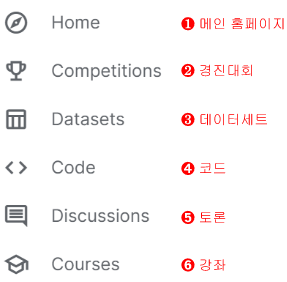
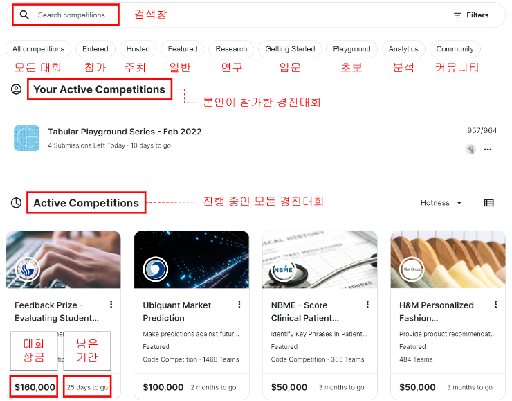

# Part I. 캐글
# Chapter 1. 왜 캐글인가?

## 1-1. 왜 캐글을 해야 하는가?

- 세상이 바뀌어 앞으로의 기술은 알고리즘만으로는 해결하기 어려운 문제들에 도전하고 있다.
  * ex. 데이터 과학, 머신러닝, 딥러닝
- 이 분야의 핵심은: **"데이터"**

### 데이터 과학 및 머신러닝 역량 강화
### 공유와 경쟁의 상승효과
- 경진대회를 진행하면서 참가자는 자신이 작성한 노트북을 다른 사람들과 공유
- 다른 참가자는 공유된 노트북을 활용하여 새로운 노트북을 만들어 공유
- 공유의 선순환
- 캐글러가 공유한 노트북만 잘 활용해도 성능 좋은 모델을 개발할 수 있다. 
- 캐글은 메달 시스템이 잘 구축되어 있어서 참여자는 경쟁 상황에서도 코드와 아이디어를 활발하게 공유

### 개인이 접할 수 없는 환경

### 취업 시 우대

## 1-2. 캐글 구성 요소 

-  캐글을 처음 접하는 사람을 위한 캐글의 구성요소

- 참가자는 캐글의
  - 경진대회
  - 데이터셋
  - 노트북
  - 토론
  - 강좌

를 활용하여 데이터 과학 역량을 쌓을 수 있다.

- 기본적으로는 경진대회를 중심으로 구성되어있음
  - A경진대회가 개최되었다면 그 경진대회를 위해 수많은 노트북이 생성되고, 활발한 토론이 진행됨.

- 캐글 홈페이지의 핵심 메뉴는
> 1. Home
> 2. Competitions
> 3. Datasets
> 4. Code
> 5. Discussions
> 6. Courses

### 경진대회 (Competition)

- 이 메뉴에서는 전 세계 누구나 참여할 수 있는 데이터 과학 및 머신러닝 대회를 볼 수 있다.

- 경진 대회에 참여한 모든 참가자는 평소에 접하기 어려운 기업 데이터를 분석하고 모델링해볼 기회를 얻을 수 있다.

- 다음은 캐글 경진대회 페이지의 모습
  - All competitions: 모든 경진대회
  - **Entered**: 본인이 참가한 대회
  - Hosted:본인이 주최한 대회
  - **Featured**: (머신러닝, 딥러닝으로 예측을 수행하는) 일반적인 대회
  - Research: 연구나 실험 목적을 갖는 특수한 형태의 대회
  - **Getting Started**: 이제 막 입문한 사람들을 위한 가장 쉬운 대회
  - **Playground**: 초보자를 위한 쉬운 대회(Getting Started 보다는 약간 높은 수준)
  - Analytics: 분석용 대회
  - Community: 커뮤니티에서 주관하는 대회

- 난이도: Featured > Playground > Getting Started

### 데이터셋(Datasets)

- 순수하게 데이터셋만 제공되는 영역

- 검색 결과에서 제목 오른쪽에 메달이 표시 (추천순, 금은동)

### 코드(Codes)

- 다른 사람이 올려놓은 캐글 코드(노트북)를 모아 놓은 페이지

### 토론(Discussions)

- 경진대회를 진행하며 궁금한 점을 다른 사람에게 물어볼 수 있다.

## 1-3. 캐글러 등급

### 캐글러 등급이란?

- 캐글러 등급은
  - Grandmaster
  - Master
  - Expert
  - Contributor
  - Novice

- 캐글은 경진대회, 데이터셋, 노트북, 토론마다 등급을 매긴다.

- 메달을 일정 개수 이상 무으면 등급이 오른다.

### 메달 🥇🥈🥉

- 경진대회, 데이터셋, 노트북, 토론마다 메달 취득 조건이 다르다.

- 경진대회 메달 조건

||0 ~ 99팀|100 ~ 249팀|250 ~ 999팀|1000팀 이상|
|---|---|---|---|---|
|금메달🥇|상위 10%|상위 10위|상위 10위 + 0.2%|상위 10위 + 0.2%|
|은메달🥈|상위 20%|상위 20%|상위 50위|상위 5%|
|동메달🥉|상위 40%|상위 40%|상위 100위|상위 10%|

- 데이터셋, 노트북, 토론 메달 조건 => 추천수(Voted)!!

||데이터셋|노트북|토론|
|---|---|---|---|
|금메달🥇|50개|50개|10개|
|은메달🥈|20개|20개|5개|
|동메달🥉|5개|5개|1개|

