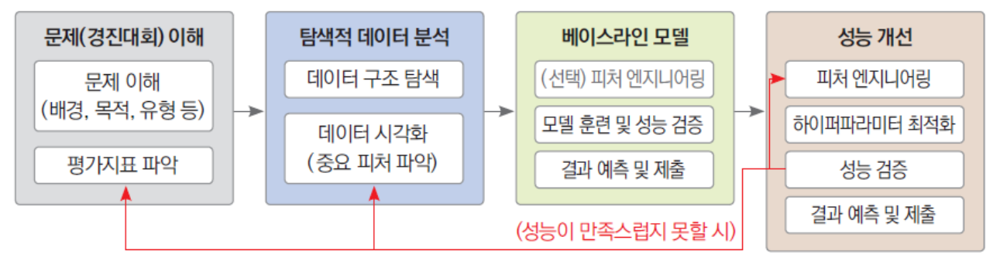
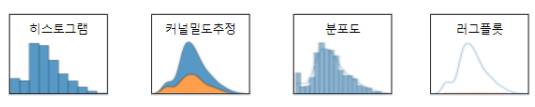
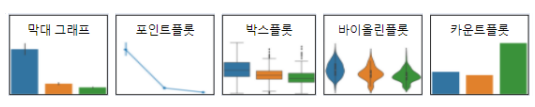
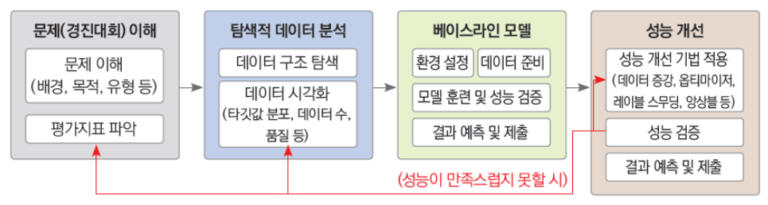

# Part I. 캐글

# Chapter 3. 문제해결 프로세스 및 체크리스트

## 3-1. 머신러닝 문제해결 프로세스
- 머신러닝 대회의 일반적인 프로세스

## 💡 머신러닝 문제해결 체크리스트

### 0. 문제(경진대회) 이해 📖
- **제목**
- **미션**
- **문제유형**
    - 회귀
    - 이진분류
    - 다중분류
    - 기타
- **평가지표**

   
### 1. 탐색적 데이터 분석 🕵️‍♂️📊
- **데이터 둘러보기(구조 탐색)**
    - 파일별 용도 파악
    - 데이터 양
        - 레코드 수
        - 피처 수
        - 전체 용량
        - 기타
    - 피처 이해
        - 이름
        - 의미
        - 데이터 타입
        - 결측값 개수
        - 고윳값 개수
        - 실제값
        - 데이터 종류
        - 기타
    - 훈련 데이터와 테스트 데이터 차이
    - 타깃값 (제출, 예측해야 하는 값)
        

- **데이터 시각화** 
    - (필요 시) 효과적인 시각화를 위한 피처 엔지니어링
    - 각종 시각화
        - 수치형 데이터 시각화
            - 
        - 범주형 데이터 시각화
            - 
        - 데이터 관계 시각화
            - 

    - 피처 파악
        - 추가할 피처
        - 제거할 피처
        - 피처별 인코딩 전략
    - 이상치 파악
        - 해당 피처별 처리방법
- <U>**결과물**
    - 추가, 제가할 피처 목록
    - 인코딩 전략
    - 이상치 처리 전략</U>

### 2. 베이스라인 모델 ⚽🎲

- **준비하기**
    - 데이터 불러오기
    - (필요 시) 기본적인 피처 엔지니어링
    - 평가지표 계산 함수 준비
    - <U>**결과물**
        - 데이터
        - 평가지표 계산 함수</U>

- **모델 훈련**
    - 모델 생성
    - 훈련
    - <U>**결과물**
        - 훈련된 베이스라인 모델</U>
    

- **성능 검증**
    - 예측 (검증 데이터 사용)
    - 평가
    - <U>**결과물**
        - 에측 결과
        - 검증 평가 점수</U>

- **예측 및 결과 제출**
    - 최종 예측 (테스트 데이터 사용)
    - 제출 파일 생성
    - 제출
    - <U>**결과물**
        - 제출 파일
        - 기준 private/public 점수</U>
        

### 3. 성능 개선 🤔👨‍💻

- **피처 엔지니어링**
    - 이상치 제거
    - 결측값 처리
    - 데이터 인코딩
    - 타입 변경
    - 파생 피처 생성
    - 시차 피처 생성 (시계열 데이터)
    - 피처 스케일링
    - 피처명 한글화
    - 데이터 다운캐스팅
    - 데이터 조합 생성
    - 필요 없는 피처 제거
    - 기타
    - <U>**결과물**
        - 피처 엔지니어링된 훈련 데이터와 검증 데이터</U>

- **모델 훈련 with 하이퍼파라미터 최적화**
    - 하이퍼파라미터 종류와 의미 파악
    - 선별
        - 최적화할 하이퍼파라미터
        - 값을 고정할 하이퍼파라미터
    - 값 범위 설정
    - 최적화 기법
        - 그리드서치
        - 베이지안서치
        - OOF 예측
        - 기타
    - 모델 생성 및 훈련 (최적화)
    - <U>**결과물**
        - 최적 하이퍼파라미터
        - 훈련된 모델</U>

- **성능 검증**
    - 예측 (검증 데이터 사용)
    - 성능 평가
    - <U>**결과물**
        - 예측 결과
        - 검증 평가 점수</U>
    - *만족스러운 결과가 나올 떄까지 피처 엔지니어링, 훈련 (다른 모델로 교체 포함), 성능 검증 반복*

- **예측 및 결과 제출**
    - 최종 예측 (테스트 데이터 사용)
    - 제출 파일 생성
    - 제출
    - <U>**결과물**
        - 제출 파일
        - 최종 private/public 점수</U>

---

## 3-2. 딥러닝 문제해결 프로세스 

- 캐글 경진대회 중 이미지 분류 딥러닝 대회의 일반적인 프로세스

## 💡 딥러닝 문제해결 체크리스트 (이미지 분류)

### 0. 문제(경진대회) 이해 📖
- **제목**
- **미션**
- **문제유형**
    - 이진분류
    - 다중분류
    - 기타
- **평가지표**

   
### 1. 탐색적 데이터 분석 🕵️‍♂️📊
- **데이터 둘러보기(구조 탐색)**
    - 파일별 용도 파악
    - 데이터 양
        - 파일 수 및 크기
        - 전체 용량
        - 기타
    - 피처 이해
        - 이름
        - 의미
        - 기타
    - 훈련 데이터와 테스트 데이터 차이
    - 타깃값 (제출, 예측해야 하는 값)
        

- **데이터 시각화** 
    - 타깃값 분포
    - 분류별 이미지 출력
        - 이미지 형태 확인 (컬러, 크기)
        - 불량 이미지 포함 여부

### 2. 베이스라인 모델 ⚽🎲

- **환경설정**
    - 시드값 고정 (결과 재현 필요 시)
    - GPU 장비 정검
    - <U>**결과물**
        - GPU를 활용할 수 있는 작업 환경</U>

- **데이터 준비**
    - 훈련/검증 데이터 분리
    - 데이터셋 클래스 정의
    - 데이터 증강
        - [torchvision.transforms 변환기 확인](https://pytorch.org/vision/stable/transforms.html)
        - [Albumentations 변환기 확인](https://github.com/albumentations-team/albumentations)
        - 활용할 변환기 목록
    - 데이터셋 생성
    - 데이터 로더 생성

    - <U>**결과물**
        - 훈련용/검증용 데이터 로더
        - 데이터셋 (클래스)</U>
        

- **모델 훈련**
    - 모델 생성
        - [torchvision.models 모듈 확인](https://pytorch.org/vision/stable/models)
        - [pretrainedmodels 모듈 확인](https://github.com/Cadene/pretrained-models.pytorch#readme)
        - 기타 가용한 모듈 인터넷 검색
        - 직접구현
        - 선정 모델:

    - 훈련

    - <U>**결과물**
        - 훈련된 베이스라인 모델</U>
        

- **성능 검증**
    - 예측 (검증 데이터 사용)
    - 평가

    - <U>**결과물**
        - 예측 결과
        - 검증 평가 점수</U>

- **예측 및 결과 제출**
    - 최종 예측 (테스트 데이터 사용)
    - 제출 파일 생성
    - 제출
    - <U>**결과물**
        - 제출 파일
        - 기준 private/public 점수</U>

### 3. 성능 개선 🤔👨‍💻

- **데이터 증강**
    - 활용할 변환기 목록
    - <U>**결과물**
        - 구성이 완료된 훈련 데이터용 이미지 변환기</U>

- **모델 개선**
    - 사전 학습된 모델 물색
    - 선정 모델 목록

- **훈련 단계 최적화**
    - 손실 함수:
    - 옵티마이저:
    - 스케줄러:
    - 에폭 수:
    - 기타

- **예측 단계 최적화**
    - 테스트 단계 데이터 증강 (TTA)
    - 레이블 스무딩
    - 기타

- **성능 검증**
    - 예측 (검증 데이터 사용)
    - 성능 평가
    - <U>**결과물**
        - 예측 결과
        - 검증 평가 점수</U>
    - *만족스러운 결과가 나올 떄까지 피처 엔지니어링, 훈련 (다른 모델로 교체 포함), 성능 검증 반복*

- **예측 및 결과 제출**
    - 최종 예측 (테스트 데이터 사용)
    - 제출 파일 생성
    - 제출
    - <U>**결과물**
        - 제출 파일
        - 최종 private/public 점수</U>
