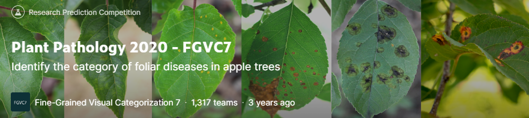

# **Part III. 딥러닝 문제해결**

# **Chapter 12. [경진대회] 병든 잎사귀 식별**
### **Plant Pathology 2020 - FGVC7**
### Identify the category of foliar diseases in apple trees

- [Kaggle Link](https://www.kaggle.com/c/plant-pathology-2020-fgvc7)

 
 

# 0. 경진대회 이해 💁🏻‍♂️

- **Goal**: 병든 사과나무 잎사귀를 식별하는 다중분류 경진대회
    - 타깃값은 다음과 같이 총 4개:
        - `healthy`: 건강한 잎사귀
        - `multiple_diseases`: 여러 질병에 걸린 잎사귀
        - `rust`: 녹병에 걸린 잎사귀
        - `scab`: 붉은 곰팡이병에 걸린 잎사귀
    - <u>잎사귀가 각 타깃값일 확률을 예측하면 된다.</u>

 

## 0-1. 데이터 특징 📚

- 주어진 데이터는 다음과 같다:
    - `train.csv`: 훈련 이미지 데이터 ID(파일명)과 타깃값
    - `test.csv`: 테스트 이미지 데이터 ID(파일명)
    - `images`: 훈련/테스트 이미지 데이터가 들어 있는 디렉터리(`jpg`파일들)
    - `sample_submission.csv`: 샘플 제출 파일

 
 

# 1. 분석 정리 및 모델링 전략

## 1-1. 분석 정리

1. `csv` 파일의 `id` 피처는 이미지 파일명입니다. 파일의 경로명과 확장자만 추가하면 파일의 위치를 바로 얻어올 수 있습니다.

2. 훈련 데이터에는 잎사귀 상태(타깃값)를 4개 열로 나눠 원-핫 인코딩 형태로 기록해뒀습니다.

3. 타깃값들의 비율 차이가 커서 훈련 데이터와 검증 데이터를 나눌 때, 타깃값 비율에 맞게 나눠야 합니다.

 

## 1-2. 모델링 전략

- 이번 장에서는 딥러닝 모델을 직접 설계하지 않고, <u>성능이 우수하다고 알려진 사전 훈련 모델을 활용해 전이 학습을 수행</u>할 것.

 

- **베이스라인 모델**: 얕은 CNN
    - **신경망 구조**: 합성곱 x 2, 풀링, 평탄화, 전결합
    - **옵티마이저**: SGD
    

 

- **성능 개선**: 살짝 깊은 CNN
    - **데이터 증강**: 다양한 변환기 사용
    - **신경망 구조**: 합성곱 x 5, 배치 정규화, 풀링, 평탄화, 전결합 x 2
    - **옵티마이저**:Adamax
    - **기타**: 훈련 에폭 수 증가
    

 
 

# 2. 핵심 요약

1. 