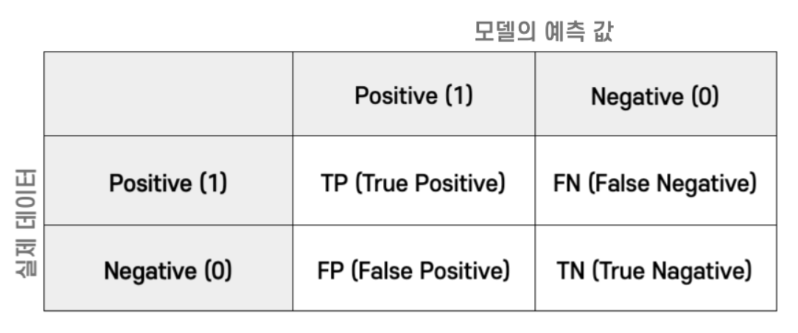
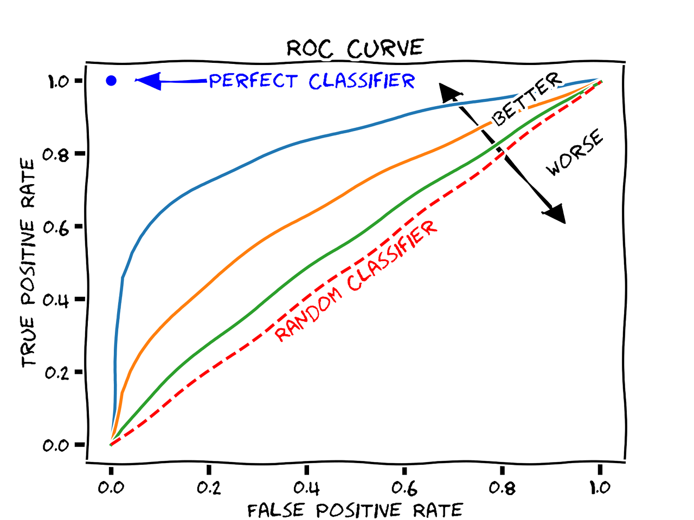

# Part II. 머신러닝 문제해결

- 머신러닝 모델을 사용하는 캐글 경진대회에 익숙해지자!


# Chapter 5. 다시 살펴보는 머신러닝 주요 개념


### 목차

- 분류와 회귀
    - 회귀 평가지표
- 분류 평가지표
    - 오차 행렬
        - 정확도
        - 정밀도
        - 재현율
        - F1 점수
    - 로그 손실
    - ROC, AUC
- 데이터 인코딩
    - 레이블 인코딩
    - 원-핫 인코딩
- 피처 스케일링
    - min-max 정규화
    - 표준화
- 교차검증
    - K 폴드
    - 층화 K 폴드
- 주요 머신러닝 모델
    - 선형 회귀
    - 로지스틱 회귀
    - 결정 트리
    - 앙상블
    - 랜덤 포레스트
    - XGBoost
    - LightGBM
- 하이퍼파라미터 최적화
    - 그리드서치
    - 랜덤서치


## 5-1. 분류와 회귀

- 대부분의 캐글 경진대회는 분류나 회귀 문제를 다룬다.
- 특히 분류 문제가 많다.


### 사이킷런의 `metrics` 라이브러리를 활용해 회귀 평가지표 값 구하기

```python
import numpy as np
# MAE, MSE, MSLE, R2 임포트
from sklearn.metrics import mean_absolute_error, mean_squared_error, mean_squared_log_error, r2_score

true = np.array([1, 2, 3, 2, 3, 5, 4, 6, 5, 6, 7, 8, 8]) # 실제값
preds = np.array([1, 1, 2, 2, 3, 4, 4, 5, 5, 7, 7, 6, 8]) # 예측값

MAE = mean_absolute_error(true, preds)
MSE = mean_squared_error(true, preds)
RMSE = np.sqrt(MSE)
MSLE = mean_squared_log_error(true, preds)
RMSLE = np.sqrt(mean_squared_log_error(true, preds))
R2 = r2_score(true, preds)

# 출력
print(f'MAE:\t {MAE:.4f}')
print(f'MSE:\t {MSE:.4f}')
print(f'RMSE:\t {RMSE:.4f}')
print(f'MSLE:\t {MSLE:.4f}')
print(f'RMSLE:\t {RMSLE:.4f}')
print(f'R2:\t {R2:.4f}')
```

```
MAE:	 0.5385
MSE:	 0.6923
RMSE:	 0.8321
MSLE:	 0.0296
RMSLE:	 0.1721
R2:	     0.8617
```


## 5-2. 분류 평가지표

- 분류 문제에서 사용하는 평가지표를 알아보자
    - 오차 행렬
    - 로그 손실
    - ROC 곡선
    - AUC

### 5-2-1. 오차 행렬 (Confusion matrix)



- 참 양성, 거짓 양성, 거짓 음성, 참 음성은 각각 약어로 TP, FP, FN, TN으로 표시
- 오차 행렬을 활용한 주요 평가지표
    - 정확도(Accuracy)
        - $$\dfrac{TP + TN}{TP + FP + FN + TN}$$
    - 정밀도(Precision)
        - $$\dfrac{TP}{TP + FP}$$
        - 양성 예측의 정확도
        - 음성을 양성으로 잘못 판단하면 문제가 발생하는 경우
            - 양성: 검출하기 원하는 상태
    - 재현율(Recall)
        - $$\dfrac{TP}{TP + FN}$$
        - 실제 양성 값 중 양성으로 잘 예측한 값의 비율
        - 양성을 음성으로 잘못 판단하면 문제가 되는 경우
    - F1 점수(F1 Score)
        - $$F1 = \dfrac{2}{\frac{1}{precision} + \frac{1}{recall}} = 2\dfrac{precision \times recall}{precision + recall}$$
        - 정밀도와 재현율을 조합한 평가지표


### 5-2-2. 로그 손실(Logloss)
- 분류 문제에서 타깃값을 확률로 예측할 때 기본적으로 사용하는 평가지표
- 작을수록 좋음
$$logloss = - \dfrac{1}{N} \sum^N_{i=1} ( y_i\log(\hat y_i) + (1 - y_i)\log(1 - \hat y_i) )$$


### 5-2-3. ROC 곡선과 AUC

- **ROC(Receiver Operating Characteristic) 곡선**: 참 양성 비율(TPR)에 대한 거짓 양성 비율(FPR) 곡선
- **AUC(Area Under the Curve)**: ROC 곡선 아래 면적
- AUC는 기본적으로 예측값이 확률이 분류 문제에서 사용


> - 타깃값(이산값)으로 예측 시 분류 평가 지표: 정확도, 정밀도, 재현율, F1 점수
> - 타깃 확률로 예측 시 분류 평가지표: 로그 손실, AUC




- TPR은 양성을 얼마나 정확히 예측 = 재현율 $$\dfrac{TP}{TP + FN}$$

- TNR은 음성을 얼마나 정확히 예측하는지 지표 = 특이도 (specificity) $$\dfrac{TN}{FP + TN}$$

- 거짓양성비율 (FPR) = 1 - TNR (민감도) $$FPR = \dfrac{FP}{FP+TN}$$


## 5-3. 데이터 인코딩

- 머신러닝 모델은 문제 데이터를 인식하지 못함
- 문자로 구성된 범주형 데이터는 숫자로 바꿔야 한다.

- **데이터 인코딩**: 범주형 데이터를 숫자 형태로 바꾸는 작업


### 5-3-1. 레이블 인코딩
- 범주형 데이터를 숫자로 일대일 매핑해주는 인코딩 방법
- 사이킷런의 `LabelEncoder`로 구현할 수 있다.
- 다음은 레이블 인코딩을 적용해 과일 문자열 데이터를 숫자형으로 변환하는 코드

```python
from sklearn.preprocessing import LabelEncoder # 레이블 인코더

fruits = ['사과', '블루베리', '바나나', '귤', '블루베리', '바나나', '바나나', '사과']

# 레이블 인코더 생성
label_encoder = LabelEncoder()
# 레이블 인코딩 적용
fruits_label_encoded = label_encoder.fit_transform(fruits)

print('레이블 인코딩 적용 후 데이터:', fruits_label_encoded)
```
```
레이블 인코딩 적용 후 데이터: [3 2 1 0 2 1 1 3]
```


- 단점: 명목형 데이터를 레이블 인코딩하면 모델 성능이 낮아짐
- 서로 가까운 숫자를 비슷한 데이터라고 판단하기 때문이다
- 이 문제는 원-핫 인코딩으로 해결할 수 있다. 


### 5-3-2. 원-핫 인코딩 (One-hot encoding)


- 원-핫 인코딩은 여러 값 중 하나(One)만 활성화(Hot)하는 인코딩이다. 
- 실행 절차
    1. 인코딩하려는 피처의 고윳값 개수
    2. 피처의 고윳값 개수만큼 열을 추가
    3. 각 고윳값에 해당하는 열에 1을 표시하고 나머지 열에는 0을 표시한다.


- 원-핫 인코딩은 레이블 인코딩의 문제(서로 가까운 숫자를 비슷한 데이터를 판단하는 문제)를 해결합니다.
- 단점: 열 개수가 지나치게 많아진다는 단점
    - 피처의 고윳값이 많으면 그만큼 열 개수와 메모리 사용량이 늘어나기 때문에 모델 훈련 속도가 느려질 우려

> 명목형 피처에 고윳값이 상당히 많을 땐 어떻게 해결해야 할까?
> 1. 비슷한 고윳값끼리 그룹화
>    - 그룹화하면 해당 명목형 피처의 고윳값 개수가 줄어드는 효과
> 2. 빈도가 낮은 고윳값을 '기타(etc)'로 처리하기
> 3. 다른 인코딩 적용하기
>    - 타깃인코딩, 프리퀀시 인코딩 등 그외 인코딩 기법
> - 한편 고윳값 개수가 많아도 데이터 크기가 그렇게 크지 않다면 그냥 원-핫 인코딩을 적용하기도 한다.
> - 데이터가 크지 않으니 열 개수가 늘어나도 모델 훈련 속도에 크게 영향을 주지 않기 때문

- 다음은 문자열 데이터를 원-핫 인코딩하는 코드
- 문자열 데이터에 바로 원-핫 인코딩을 적용할 순 없으니 레이블 인코딩으로 숫자형 데이터로 먼저 변환

```python
from sklearn.preprocessing import LabelEncoder, OneHotEncoder

fruits = ['사과', '블루베리', '바나나', '귤', '블루베리', '바나나', '바나나', '사과']

# 레이블 인코더, 원-핫 인코더 생성
label_encoder = LabelEncoder()
onehot_encoder = OneHotEncoder()

# 레이블 인코딩 적용(문자 데이터 -> 숫자 데이터)
fruits_label_encoded = label_encoder.fit_transform(fruits)
# 원-핫 인코딩 적용
fruits_onehot_encoded = onehot_encoder.fit_transform(fruits_label_encoded.reshape(-1, 1))

print('원-핫 인코딩 적용 후 데이터:\n', fruits_onehot_encoded.toarray())
```

```
원-핫 인코딩 적용 후 데이터:
 [[0. 0. 0. 1.]
 [0. 0. 1. 0.]
 [0. 1. 0. 0.]
 [1. 0. 0. 0.]
 [0. 0. 1. 0.]
 [0. 1. 0. 0.]
 [0. 1. 0. 0.]
 [0. 0. 0. 1.]]
```


- 레이블 인코딩된 데이터는 1차원이라서 중간에 `reshape(-1,1)` 메서드를 이용해 2차원으로 바꿈

> `reshape()`용법
> - `reshape()` 메서드는 배열 형상을 바꿀 때 사용
> - 다음 1차원 배열인 `fruits_label_encoded`를 예로 `reshape()`용법을 알아봅시다.
> ```python
> fruits_label_encoded
> ```
> ```
> array([3, 2, 1, 0, 2, 1, 1, 3])
> ```
> - 이를 (4, 2) 형상의 행렬로 바꾸려면 다음과 같이 `reshape(4,2)`를 호출하면 됩니다.
> 
> ```python
> fruits_label_encoded.reshape(4,2)
> ```
> ```
> array([[3,2],
>        [1,0],
>        [2,1],
>        [1,3]])
> ```
> 
> - `reshape()`에 넘기는 값 중 하나를 -1로 지정할 수도 있습니다.
> - 그러면 원본 데이터와 나머지 형상을 참고해서 최종 형상을 적절히 바꿔줍니다.
> 
> 
> 
> ```
> fruits_label_encoded.reshape(-1,1)
> ```
> ```
> array([[3],
>        [2],
>        [1],
>        [0],
>        [2],
>        [1],
>        [1],
>        [3]])
> ```
> - 알아서 바꿔줌


- 판다스의 `get_dummies()` 함수를 이용하면 다음과 같이 더 간단하게 구현이 가능
- 문자열 데이터를 숫자형으로 바꾸지 않아도 되어 훨씬 편리


```python
import pandas as pd

pd.get_dummies(fruits)
```
```
    귤	바나나	블루베리	사과
0	0	0	0	1
1	0	0	1	0
2	0	1	0	0
3	1	0	0	0
4	0	0	1	0
5	0	1	0	0
6	0	1	0	0
7	0	0	0	1
```


## 5-4. 피처 스케일링 (Feature Scaling)

- 서로 다른 피처 값의 범위(최댓값 - 최솟값)가 일치하도록 조정하는 작업


> 단, 트리기반모델 (랜덤포래스트, XGBoost, LightGBM 등)은 피처 스케일링 필요 없음.

### 5-4-1. min-max 정규화

- 피처 값의 범위를 0~1로 조정하는 기법

$$x_{scaled} = \dfrac{x - x_{\min}}{x_{\max} - x_{\min}}$$

> 이상치가 너무 크거나 작을 때는 좋지 않을 수 있다.
> 이 때에는 표준화가 더 적합

- min-max 정규화는 사이킷런의 `MinMaxScaler`로 구현할 수 있다.

```python
import pandas as pd

height_weight_dict = {'키': [1.7, 1.5, 1.8], '몸무게': [75, 55, 60]}
df = pd.DataFrame(height_weight_dict, index=['광일', '혜성', '덕수'])

print(df)
```

```
      키  몸무게
광일  1.7   75
혜성  1.5   55
덕수  1.8   60
```


- `MinMaxScaler` 객체를 생성한 뒤 `fit()`과 `transform()` 함수를 호출하면 피처 스케일링이 적용됩니다.

```python
from sklearn.preprocessing import MinMaxScaler

# min-max 정규화 객체 생성
scaler = MinMaxScaler()

# min-max 정규화 적용
scaler.fit(df)
df_scaled = scaler.transform(df)

print(df_scaled)
```

```
[[0.66666667 1.        ]
 [0.         0.        ]
 [1.         0.25      ]]
```

- 한 번에 실행할 수도 있다.

```python
# min-max 정규화 객체 생성
scaler = MinMaxScaler()

# min-max 정규화 적용
df_scaled = scaler.fit_transform(df)

print(df_scaled)
```
```
[[0.66666667 1.        ]
 [0.         0.        ]
 [1.         0.25      ]]
```


### 5-4-2. 표준화 (Standardization)

- 평균이 0, 분산이 1이 되도록 피처 값을 조정하는 기법

$$x_{scaled} = \dfrac{x - \bar x}{\sigma}$$

- 사이킷런의 `StandardScaler`로 표준화 구현


```python
from sklearn.preprocessing import StandardScaler

# StandardScaler 객체 생성
scaler = StandardScaler()

# 표준화 적용
df_scaled = scaler.fit_transform(df)

print(df_scaled)

```

```
[[ 0.26726124  1.37281295]
 [-1.33630621 -0.98058068]
 [ 1.06904497 -0.39223227]]
```

## 5-5. 교차검증

- 과적합 피하기, 제출 전 모델 성능 확인을 위해

### 5-5-1. K 폴드 교차 검증 (K-Fold Cross Validation)


```python
import numpy as np
from sklearn.model_selection import KFold

data = np.array([0, 1, 2, 3, 4, 5, 6, 7, 8, 9])

folds = KFold(n_splits=5, shuffle=False)

for train_idx, valid_idx in folds.split(data):
    print(f'훈련 데이터: {data[train_idx]}, 검증 데이터: {data[valid_idx]}')
```


```
훈련 데이터: [2 3 4 5 6 7 8 9], 검증 데이터: [0 1]
훈련 데이터: [0 1 4 5 6 7 8 9], 검증 데이터: [2 3]
훈련 데이터: [0 1 2 3 6 7 8 9], 검증 데이터: [4 5]
훈련 데이터: [0 1 2 3 4 5 8 9], 검증 데이터: [6 7]
훈련 데이터: [0 1 2 3 4 5 6 7], 검증 데이터: [8 9]
```


- 데이터 섞기

```python
folds = KFold(n_splits=5, shuffle=True)

for train_idx, valid_idx in folds.split(data):
    print(f'훈련 데이터: {data[train_idx]}, 검증 데이터: {data[valid_idx]}')
```


## 5-5-2. 층화 K 폴드 교차 검증 (Stratified K-fold CV)

- 타깃값이 골고루 분포되게 폴드를 나누는 검증 방법

- 특정 타깃값이 다른 타깃값보다 굉장히 적은 경우에 주로 층화 K 폴드 교차 검증을 사용
- 참고로 층화 K 폴드 교차 검증은 분류 문제에서만 쓰인다.


```python
from sklearn.model_selection import StratifiedKFold

X = np.array(range(50))
y = np.array(['스팸']*5 + ['일반']*45)

folds = StratifiedKFold(n_splits=5) # '층화' K 폴드 교차 검증

for idx, (train_idx, valid_idx) in enumerate(folds.split(X, y)):
    print(f'Fold {idx+1} 검증 데이터 타깃 값:')
    print(y[valid_idx], '\n')
```


```
Fold 1 검증 데이터 타깃 값:
['스팸' '일반' '일반' '일반' '일반' '일반' '일반' '일반' '일반' '일반'] 

Fold 2 검증 데이터 타깃 값:
['스팸' '일반' '일반' '일반' '일반' '일반' '일반' '일반' '일반' '일반'] 

Fold 3 검증 데이터 타깃 값:
['스팸' '일반' '일반' '일반' '일반' '일반' '일반' '일반' '일반' '일반'] 

Fold 4 검증 데이터 타깃 값:
['스팸' '일반' '일반' '일반' '일반' '일반' '일반' '일반' '일반' '일반'] 

Fold 5 검증 데이터 타깃 값:
['스팸' '일반' '일반' '일반' '일반' '일반' '일반' '일반' '일반' '일반'] 
```


## 5-6. 주요 머신러닝 모델

- 선형 회귀
- 로지스틱 회귀
- 결정 트리
- 앙상블 학습
- 랜덤 포레스트
- XGBoost
- LightGBM


### 5-6-1. 선형 회귀 (Linear Regression) 모델

### 5-6-2. 로지스틱 회귀 (Logistic Regression) 모델

### 5-6-3. 결정 트리 (Decision Tree)

- 분류와 회귀 문제에 모두 사용 가능한 모델

    1. 우선 데이터를 가장 잘 구분하는 조건을 정한다.
    2. 조건을 기준으로 데이터를 두 범주로 나눈다.
    3. 나뉜 각 범주이 데이터를 잘 구분하는 조건을 다시 정한다.
    4. 조건에 따라 각 범주에 속한 데이터를 다시 분할한다.
    5. 이런 식으로 계속 분할해 최종 결정 값을 구한다.


- 머신러닝에서 결정 트리는 어떤 방식으로 데이터를 분할할까?
    - 노드 내 데이터의 불순도를 최소화하는 방향으로 분할
    - **불순도 (Impurity)**: 한 범주 안에 서로 다른 데이터가 얼마나 섞여있는지
    - 불순도 측정: 
        - **엔트로피 (Entropy)**: '불확실한 정도', 다른 데이터의 비율이 비등해질수록 엔트로피는 1에 가까워진다.
        - **정보 이득(Information Gain)** = 1 - 엔트로피: 결정트리는 정보이득을 최대화 하는 방향으로 노드를 분할
        - **지니 불순도(Gini Impurity)**: 엔트로피와 비슷


**결정 트리 구현**

- 사이킷런으로 결정트리를 구현할 수 있다. 
- 분류용 모델: `DecisionTreeClassifier`
- 회귀용 모델: `DecisionTreeRegressor`


- **`DecisionTreeClassifier`의 파라미터**
    - `criterion`: 분할 시 사용할 불순도 측정 지표
        - `'gini'`를 전달하면 지니 불순도를 활용해 분할
        - `'entropy'`를 전달하면 정보 이득 방법으로 분할
        - 기본값 = `'gini'`
    - `max_depth`: 트리의 최대 깊이
        - `max_depth`를 규정하지 않으면 모든 말단 노드의 불순도가 0이 되거나 노드에 있는 데이터 수가 `min_sample_split`보다 작을 때까지 트리 깊이가 깊어짐
        - 기본값 = `None`
    - `min_sample_split`: 노드 분할을 위한 최소 데이터 개수
        - 노드 내 데이터 개수가 이 값보다 작으면 더 이상 분할하지 않음
        - 정수형으로 전달하면 최소 데이터 개수를 의미
        - 실수형으로 전달하면 전체 데이터 개수 중 최소 데이터 개수 비율을 의미
        - 기본값 = 2

    - `min_samples_leaf`: 말단 노드가 되기 위한 최소 데이터 개수
        - 분할 후 노드 내 데이터 개수가 이 값보다 작으면 더 이상 분할하지 않음
        - 정수형으로 전달하면 최소 데이터 개수를 의미
        - 실수형으로 전달하면 전체 데이터 개수 중 최소 데이터 개수 비율을 의미
        - 기본값 = 1

    - `max_features`: 분할에 사용할 피처 개수
        - 정수형으로 전달하면 피처 개수를 의미
        - 실수형으로 전달하면 전체 피처 개수 중 분할에 사용될 피처 개수 비율을 의미
        - `'auto'`나 `'sqrt'`을 전달하면 sqrt(전체 피처 개수)가 분할에 사용될 피처 개수
        - `'log2'`를 전달하면 $\log_2$(전체 피처 개수)가 부날에 사용될 피처 개수임
        - `None`을 전달하면 전체 피처를 분할에 사용
        - 기본값 = `None`

- 결정 트리에 조건이 많을수록 분할이 많고 트리가 깊어짐
- 분할을 지나치게 많이하면 과적합 우려
```python
from sklearn.tree import DecisionTreeClassifier
from sklearn.model_selection import train_test_split
from sklearn.datasets import load_breast_cancer

# 유방암 데이터 세트 불러오기
cancer_data = load_breast_cancer()
# 훈련, 테스트 데이터로 분리
X_train, X_test, y_train, y_test = train_test_split(cancer_data['data'], 
                                                cancer_data['target'], 
                                                stratify=cancer_data['target'], 
                                                test_size=0.4, 
                                                random_state=42)

decisiontree = DecisionTreeClassifier(random_state=42) # 결정 트리 정의
decisiontree.fit(X_train, y_train) # 모델 훈련

accuracy = decisiontree.score(X_test, y_test) # 정확도 측정

# 테스트 데이터를 활용하여 결정 트리 모델 정확도 출력
print(f'결정 트리 정확도: {accuracy:.3f}')
```
```
결정 트리 정확도: 0.930
```

### 5-6-4. 앙상블 학습 (Ensemble Learning)

- 다양한 모델이 내린 결과를 결합하는 기법


### 5-6-5. 랜덤 포레스트 (Random Forest)
- 결정 트리를 배깅 방식으로 결합한 모델

**랜덤 포레스트 구현**
- 사이킷런으로 랜덤 포레스트를 구현할 수 있다.
- 분류 모델: `RandomForestClassifier`
- 회귀 모델: `RandomForestRegressor`

- **`RandomForestClassifier`의 파라미터**

    - `n_estimator`: 랜덤 포레스트를 구성할 결정 트리 개수
        - 기본값 = 100
    - `criterion`: 분할 시 사용할 분순도 측정 지표
    - `max_depth`: 트리의 최대 깊이
    - `min_sample_split`: 노드 분할을 위한 최소 데이터 개수
    - `min_sample_leaf`: 말단 노드가 되기 위한 최소 데이터 개수
    - `max_features`: 분할에 사용할 피처 개수
    


```python
from sklearn.ensemble import RandomForestClassifier
from sklearn.model_selection import train_test_split
from sklearn.datasets import load_breast_cancer

# 유방암 데이터 세트 불러오기
cancer_data = load_breast_cancer()
# 훈련, 테스트 데이터로 분리
X_train, X_test, y_train, y_test = train_test_split(cancer_data['data'], 
                                                cancer_data['target'], 
                                                stratify=cancer_data['target'], 
                                                test_size=0.4, 
                                                random_state=42)

randomforest = RandomForestClassifier(random_state=42) # 랜덤 포레스트 정의
randomforest.fit(X_train, y_train) # 모델 훈련

accuracy = randomforest.score(X_test, y_test) # 정확도 측정

# 테스트 데이터를 활용하여 랜덤 포레스트 모델 정확도 출력
print(f'랜덤 포레스트 정확도: {accuracy:.3f}')
```

```
랜덤 포레스트 정확도: 0.939
```


### 5-5-6. XGBoost (Extreme Gradient Boosting) ⭐

- 성능이 우수한 트리 기반 부스팅 알고리즘
- 많은 캐글 우승자가 XGBoost를 사용할 정도로 성능이 좋음


- 랜덤 포레스트는 결정 트리를 병렬로 배치하지만 -> 배깅
- XGBoost는 직렬로 배치 -> 부스팅
    - 부스팅 방식이므로 직전 트리가 예측한 값을 다음 트리가 활용해서 예측값을 조금씩 수정함
- 파이썬 래퍼 XGBoost를 사용하려면 `Dmatrix` 객채를 활용해 XGBoost 전용 데이터셋을 만들어야 한다.

- **`xgboost.DMatrix()`의 파라미터**
    - `Data`: `xgboost.DMatrix`용 데이터셋
        - 넘파이 배열, 판다스 `DataFrame`, `scipy.sparse`, `os.PathLike`, 문자열 타입을 전달할 수 있음 (`os.PathLike`나 문자열이면 데이터 파일 경로를 의미)
    - `label`: 타깃값
        - 배열 타입을 전달할 수 있음

- **XGBooot 모델은 하이퍼파라미터**가 많다.
- 이 하이퍼파라미터들은 딕셔너리 형태로 `train()` 메서드의 `params` 파라미터에 전달하면 된다.
- XGBoost 하이퍼파라미터 목록: https://xgboost.readthedocs.io/en/latest/parameter.html

    - `booster`: 부스팅 알고리즘
        - 트리 기반의 모델일 때는 `'gbtree'`, `'dart'`를 선택
        - 선형 모델일 때는 `'gblinear'`를 선택
        - (`'gblinear'`는 성능이 나빠 잘 쓰지 않음, `'dart'`는 드롭아웃을 적용한 `'gbtree'`라고 보면 됩니다.)
        - 기본값 = `'gbtree'`
    - `objective`: 훈련 목적
        - 회귀 문제에서는 주로 `reg:squarederror`를 사용
        - 확률값을 구하는 이진분류에선 `binary:logistic`을 사용
        - 소프트맥스 함수를 사용하는 다중분류에서는 `multi:softmax`를 사용
        - 확률값을 구하는 다중분류에서는 `multi:softprob`를 사용
        - 기본값 = `reg:squarederror`

    - `etc` (learning_rate): 학습률 (부스팅 스텝을 반복하면서 모델을 엡데이트하는 데 사용되는 비율)
        - 0 ~ 1 사이의 값으로 설정할 수 있으며, 일반적으로 0.0001 ~ 0.1 사이 값을 사용
        - 기본값 = 0.3

    - `max_depth`: 개별 트리의 최대 깊이
        - 과대적합을 제어하는 파라미터
        - 트리 깊이가 깊을수록 모델이 복잡해지고 과대적합될 우려가 있음
        - 일반적으로 3~10 사이의 값을 주로 사용
        - 값이 클수록 깊이가 한 단계만 늘어나도 메모리 사용량이 급격히 많아짐
        - (값이 클수록 모델 훈련속도가 느려짐)
        - 기본값 = 6

    - `subsample`: 개별 트리를 훈련할 때 사용할데이터 샘플링 비율
        - 0 ~ 1 사이 값으로 설정할 수 있음
        - 0.5로 설정하면 전체 데이터의 50%를 사용해 트리를 생성
        - 일반적으로 0.6 ~ 1 사이 값을 적용. 더 작으면 샘플링할 데이터가 너무 적음
        - 기본값 = 1

    - `colsample_bytree`: 개별 트리를 훈련할 때 사용하는 피처 샘플링 비율
        - 0 ~ 1 사이 값으로 설정할 수 있음
        - `subsample`과 유사한 개념
            - `subsample`: 전체 데이터에서 얼마나 샘플링할지 나타내는 비율
            - `colsample_bytree`: 전체 피처에서 얼마나 샘플링할지 나타내는 비율
        - 예) `colsample_bytree` 값이 0.7이면, 개별 트리를 훈련할 때 총 피처의 70%만 사용해 훈련
        - 값이 작을수록 과대적합 방지 효과가 있음
        - `subsample`과 마찬가지로 0.6 ~ 1 사이 값을 주로 사용
        - 기본값 = 1
    - `alpha` (reg_alpha): L1 규제 조정 값
        - 값이 클수록 과대적합 방지 효과
        - 기본값 = 0
    - `lambda` (reg_lambda): L2 규제 조정 값
        - 파이썬 `lambda`함수와 용어가 같아 혼동을 피하기 위해 별칭인 `reg_lambda`를 주로 사용
        - 값이 클수록 과대적합 방지 효과
        - 기본값 = 1
    - `gamma` (min_split_loss): 말단 노드가 분할하기 위한 최소 손실 감소 값
        - 0 이상 값으로 설정할 수 있음
        - 손실 감소가 `gamma`보다 크면 말단 노드를 분할
        - 값이 클수록 과대적합 방지 효과가 있음
        - 기본값 = 0
    - `min_child_weight`: 과대적합 방지를 위한 값
        - 0 이상 값으로 설정할 수 있음
        - 값이 클수록 과대적합 방지 효과가 있음
        - 기본값 = 1
    - `scale_pos_weight`: 불균형 데이터 가중치 조정 값
        - 타깃값이 불균형할 때 양성(positive) 값에 `scale_pos_weight`만큼 가중치를 줘서 균형을 맞춤 (타깃값 1을 양성 값으로 간주)
        - 일반적으로 `scale_pos_weight`값을 음성타깃값개수/양성타깃값개수 로 설정
        - 기본값 = 1
    - `random_state`: 랜덤 시드값 (코드를 반복해도 같은 결과가 나오게 지정하는 값)
        - 기본값 = `None`

- 파이썬 래퍼 XGBoost는 모델 훈련을 위해 `train()` 메서드를 제공
- 사이킷런의 `fit()` 메서드에 해당

- **`xgboost.train()`의 파라미터**
    - `params`: XGBoost 모델의 하이퍼파라미터 목록
        - 딕셔너리 타입으로 전달
    - `dtrain`: 훈련 데이터셋
        - `xgboost.DMatrix` 타입으로 전달
    - `num_boost_round`: 부스팅 반복 횟수
        - 정수형 타입으로 전달
        - `num_boost_round` 값이 클수록 성능이 좋아질 수 있으나 과대적합 우려
        - 일반적으로 `num_boost_round`를 늘리면 `learning_rate`를 줄여야 함
        - 기본값 = 10
    - `evals`: 모델 성능 평가용 검증 데이터 셋
        - (DMatrix, 문자열) 쌍들을 원소로 갖는 리스트 타입으로 전달
        - 검증 데이터셋 이름을 원하는 대로 문자열로 정하면 됨
        - 훈련을 반복하면서 훈련이 잘 되고 있는지 평가할 때 사용
        - 기본값 = 빈 배열
    - `feval`: 검증용 평가지표
        - 사용자 정의 함수 형태로 전달
        - `evals`를 활용해 모델 성능을 검증할 때 같이 사용할 사용자 정의 평가지표 함수
        - 예측값과 실젯값을 파라미터로 전달받아, 평가지표명과 평가점수를 반환하는 함수여야 함
        - 기본값 = `None`
    - `maximize`: `feval` 평가점수가 높으면 좋은지 여부
        - `True` 또는 `False`형태로 전달
    - `early_stopping_rouns`: 조기종료 조건
        - 정수형 타입으로 전달
        - 모델은 기본적으로 `num_boost_round`만큼 훈련을 반복 
        - 매 이터레이션마다 `evals`로 모델 성능을 평가하여 성능이 연속으로 좋아지지 않는다면 훈련을 중단
        - 훈련 중단에 필요한 최소 횟수가 `early_stopping_rounds`이다.
        - `early_stopping_rounds` 동안 모델 성능이 좋아지지 않는다면 훈련을 중단
        - 과대적합을 방지
        - 조기 종료를 적용하려면 `evals`에 검증 데이터가 하나 이상 있어야 함.
        - 또한, `evals`에 검증 데이터가 여러 개라면 마지막 검증 데이터를기준으로 조기종료 조건을 적용
        - 대체로 `eta`가 작으면 `early_stopping_rounds`를 크게 설정
        - `eta`가 크면 작게 설정
        - 학습률이 작으면 그만큼 가중치가 천천히 갱신되므로 조기종료 조건이 커야 함.
        - 기본값 = `None`

    - `verbose_eval`: 성능 점수 로그 설정 값
        - True/False 또는 정수형 타입으로 전달
        - True로 설정하면 매 부스팅 스텝마다 평가점수를 출력
        - 정수면 평가점수를 매 `verbose_eval` 스텝마다 출력
        - 예천대, `verbose_eval`을 100으로 설정하면 100번, 200번, 300번과 같이 띄엄띄엄 출력
        - 출력값이 너무 많아지는걸 방지하기위해 설정
        - 기본값 = True

### 5-6-7. LightGBM
- 마이크로소프트에서 개발한 LightGBM은 XGBoost와 더불어 성능이 우수한 알고리즘
- XGBoost와 성능은 비슷하지만 훈련 속도가 더 빨라서 많은 캐글러가 가장 애용하는 머신러닝 모델

- 데이터 개수가 적을 때는 과대적합되기 쉬워 과대적합 방지용 하이퍼파라미터를 조정해줘야 함.


- 파이썬 래퍼 LightGBM을 사용하려면 `lightgbm.Dataset()`으로 전용 데이터셋을 만들어야 한다.
- **`lightgbm.Dataset()`의 파라미터**
    - `data`: `ligntgbm.Dataset`용 데이터셋
        - 넘파이 배열, 판다스 DataFrame, scipy.sparse, 문자열 등의 타입을 전달할 수 있음
        - 문자열이면 파일의 경로를 의미
    - `label`: 타깃값
        - 리스트, 넘파이 1차원 배열, 판다스 Series, 열이 하나인 DataFrame 타입 또는 None을 전달할 수 있음
        - 기본값 = None

- **파이썬 래퍼 LightGBM 모델에서 주로 사용하는 하이퍼파라미터들**
    - `boosting_type`: 부스팅 알고리즘
        - 알고리즘 종류로는 `gbdt`, `dart`, `goss`, `rf`가 있음
        - 기본값 = `gbdt`
    - `objective`: 훈련 목적
        - 회귀: `'regression'`
        - 이진 분류: `'binary'`
        - 다중 분류: `'multiclass'`
        - 기본값 = `'regression'`
    - `learning_rate` (eta): 학습률 (부스팅 이터레이션을 반복하면서 모델을 엡데이트하는 데 사용되는 비율)
        - `xgboost`의 `eta`와 같은 의미
    - `num_leaves`: 개별 트리가 가질 수 있는 최대 말단 노드 개수
        - 트리 복잡도를 결정하는 주요 파라미터
        - 값이 클수록 성능이 좋아질 수 있으나 과대적합 우려가 있음
        - 기본값 = 31

    - `max_depth`: 개별 트리의 최대 깊이
        - LgithGBM은 말단 노드 중심으로 분할하므로 `max_depth`를 균형 중심 분할 모델(XGBoost)보다 크게 잡는 것이 좋음
        - 과대 적합 제어 파라미터
        - 트리 깊이가 깊을수록 모델이 복잡해지고 과적합 우려
        - 기본값 = -1 (0보다 작으면 깊이에 제한이 없음)

    - `bagging_fraction` (subsample): 개별 트리를 훈련할 때 사용할 데이터 샘플링 비율
        - xgboost의 subsample 파라미터와 같은 의미
        - 배깅을 활성화하려면 `bagging_freq`파라미터를 0이 아닌 값으로 설정해야 함
    - `feature_fraction` (colsample_bytree): 개별 트리를 훈련할 때 사용하는 피처 샘플링 비율
        - xgboost의 colsample_bytree 파라미터와 같은 의미
    - `lambda_l1` (reg_alpha): L1 규제 조정 값
        - 값이 클수록 과대적합 장지 효과가 있음
        - 기본값 = 0
    - `lambda_l2` (reg_lambda): L2 규제 조정 값
        - 값이 클수록 과대적합 방지 효과가 있음
        - 기본값 = 0
    - `min_child_samples`: 말단 노드가 되기 위해 필요한 최소 데이터 개수
        - 값이 클수록 과대적합 방지 효과가 있음
        - 기본값 = 20

    - `min_child_weight`: 과대적합 방지를 위한 값
        - 0 이상 값으로 설정할 수 있음
        - 값이 클수록 과대적합 방지 효과가 있음
        - 기본값 = 1e-3
    
    - `bagging_freq` (subsample_freq): 배깅 수행 빈도
        - 몇 번의 이터레이션마다 배깅을 수행할지 결정
        - 0 전달 시 배깅을 수행하지 않음
        - 1 전달 시 매 이터레이션마다 트리가 새로운 샘플링 데이터로 학습
        - 기본값 = 0
    - `force_row_wise`: 메모리 용량이 충분하지 않을 때 메모리 효율을 높이는 파라미터
        - 메모리 용량이 충분하지 않을 때 True를 전달하면 메모리 효율이 좋아짐
        - 기본값 = False
    - `random_state`: 랜덤 시드값 (코드를 반복 실행해도 같은 결과)
        - 기본값 = `None`


- **이번에는 훈련 메서드인 `lightgbm.train()`의 파라미터**
- `params`에는 LightGBM모델의 하이퍼파라미터를 전달

    - `params`: LightGBM 모델의 하이퍼파라미터 목록
        - 딕셔너리 타입으로 전달

    - `train_set`: 훈련 데이터셋
        - `lightbgm.Dataset` 타입으로 전달

    - `num_boost_round`: 부스팅 반복 횟수
        - `xgboost.train()`의 `num_boost_round`와 같은 의미
        - 기본값 = 100

    - `valid_sets`: 모델 성능 평가용 검증 데이터 셋
        - `lightbgm.Dataset` 타입으로 전달
        - 훈련을 반복하면서 훈련이 잘 되고 있는지 평가할 때 사용
        - 기본값 = `None`
    - `feval`: 검증용 평가지표
        - 사용자 정의 함수 형태로 전달
        - `valid_setsvals`를 활용해 모델 성능을 검증할 때 같이 사용할 사용자 정의 평가지표 함수
        - 예측값과 실젯값을 파라미터로 전달받아, 평가지표명과 평가점수를 반환하는 함수여야 함
        - 기본값 = `None`
        
    - `categorical_feature`: 범주형 데이터 파라미터
        - 이 파라미터에 전달된 데이터를 범주형 데이터로 인식함
        - 아무 값도 전달하지 않으면 `category`타입인 데이터를 범주형 데이터로 인식

    - `early_stopping_rouns`: 조기종료 조건
        - 정수형 타입으로 전달
        - 모델은 기본적으로 `num_boost_round`만큼 훈련을 반복  
        - 매 이터레이션마다 `valid_sets`로 모델 성능을 평가하여 성능이 연속으로 좋아지지 않는다면 훈련을 중단
        - 훈련 중단에 필요한 최소 횟수가 `early_stopping_rounds`이다.
        - `early_stopping_rounds` 동안 모델 성능이 좋아지지 않는다면 훈련을 중단
        - 과대적합을 방지
        - 대체로 `learning_rate`가 작으면 `early_stopping_rounds`를 크게 설정
        - `learning_rate`가 크면 작게 설정
        - 기본값 = `None`

    - `verbose_eval`: 성능 점수 로그 설정 값
        - True/False 또는 정수형 타입으로 전달
        - True로 설정하면 매 부스팅 스텝마다 평가점수를 출력
        - 정수면 평가점수를 매 `verbose_eval` 스텝마다 출력
        - 예천대, `verbose_eval`을 100으로 설정하면 100번, 200번, 300번과 같이 띄엄띄엄 출력
        - 출력값이 너무 많아지는걸 방지하기위해 설정
        - 기본값 = True


---


### 사이킷런 래퍼 모듈 vs 파이썬 래퍼 모듈

|구분|사이킷런 래퍼 모듈|파이썬 래퍼 모듈|
|---|---|---|
|모델 생성|모델이 워낙 많아서 클래스 활용해 생성 ex) `LogisticRegression()`, `XGBRegression()`, `LGBMClassifier`|별도로 모델 생성하지 않고 import한 xgboost혹은 lightgbm을 그대로 사용 ex) `import xgboost`, `import lightgbm`|
|데이터셋|별도로 데이터셋을 생성하지 않고 원본데이터 (배열, DataFrame)을 그대로 사용| 별도 데이터셋을 생성 ex) `xgboost.DMatrix()`, `lightgbm.Dataset()`|
|모델 훈련|생성한 모델 객체의 `fit()` 메서드를 호출| 임포트한 `xgboost` 혹은 `lightgbm` 모듈을 바로 사용해서 `train()` 메서드 호출|
|예측|생성한 모델 객체의 `predict()` 혹은 `predict_proba()` 메서드로 예측|`predict()` 메서드로 예측|
|하이퍼파라미터 입력 방식|모델 하이퍼파라미터는 모델 생성 시 입력하고, 훈련 하이퍼파라미터는 `fit()` 메서드에 입력|모두 `train()` 메서드에 입력. 모델 하이퍼파라미터는 `train()`의 `params` 파라미터에 일괄 입력|


## 5-7. 하이퍼파라미터 최적화
- 하이퍼파라미터는 사용자가 직접 설정해야 하는 값
- 모델이 좋은 성능을 내려면 어떤 하이퍼파라미터가 어떤 값을 가지면 좋을지를 찾는 작업.
- 대표적인 최적화 방법
    - 그리드서치
    - 랜덤서치
    - 베이지안 최적화

### 5-7-1. 그리드서치 (Grid Search)
- 주어진 하이퍼파라미터를 모두 순회하며 가장 좋은 성능을 내는 값을 찾는다.
- 모든 경우의 수를 탐색
- 시간이 오래 걸림

### 5-7-2. 랜덤서치 (Random Search)
- 하이퍼파라미터를 무작위로 탐색해 가장 좋은 성능을 내는 값을 찾는 기법


### 5-7-3. 베이지안 최적화 (Bayesian Optimization)

- 사전 정보를 바탕으로 최적 하이퍼파라미터 값을 확률적으로 추정하며 탐색하는 기법
- `bayes_opt`라는 패키지로 베이지안 최적화를 구현할 수 있다.

1) 하이퍼 파라미터 탐색 범위 설정
```python
# 하이퍼 파라미터 범위 (딕셔너리 형태)
param_bounds = {'x': (-1, 5), 
                'y': (0, 4)}
```

2) 평가지표 계산 함수 정의
```python
def eval_function(x, y):
    return -x ** 2 - (y - 2) ** 2 + 10
```

3) 베이지안 최적화 객체 생성
```python
from bayes_opt import BayesianOptimization

# 베이지안 최적화 객체 생성
optimizer = BayesianOptimization(f=eval_function,
                                 pbounds=param_bounds,
                                 random_state=0)
```

4) 최적화 수행

```python
# 베이지안 최적화 수행
optimizer.maximize(init_points=2, n_iter=10)
```

```
|   iter    |  target   |     x     |     y     |
-------------------------------------------------
|  1        |  4.002    |  2.293    |  2.861    |
|  2        |  3.121    |  2.617    |  2.18     |
|  3        |  3.832    |  2.327    |  2.869    |
|  4        |  4.596    |  2.171    |  2.832    |
|  5        | -6.227    |  3.989    |  2.559    |
|  6        |  9.467    |  0.3522   |  1.361    |
|  7        |  7.39     | -1.0      |  3.269    |
|  8        |  5.0      | -1.0      |  0.0      |
|  9        |  3.841    |  1.469    |  0.0      |
|  10       |  8.966    | -1.0      |  1.817    |
|  11       |  9.737    |  0.1806   |  2.48     |
|  12       |  5.785    |  0.4637   |  4.0      |
=================================================
```


```python
# 평가점수가 최대일 때 타깃, x, y 값 출력
optimizer.max
```
```
{'target': 9.737113614981094,
 'params': {'x': 0.18055072150995197, 'y': 2.4798831336702114}}
```