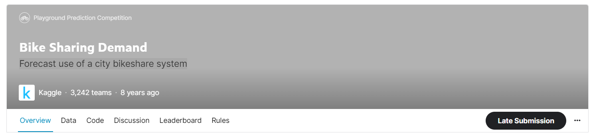

# Part II. 머신러닝 문제해결


# Chapter 6. [경진대회] 자전거 대여 수요 예측 
### Bike Sharing Demand
### Forecast use of a city bikeshare system

- [Kaggle Link](https://www.kaggle.com/competitions/bike-sharing-demand)


## 0. 경진대회 이해

- 워싱턴 D.C의 자전거 무인 대여 시스템 과거 기록을 기반으로 향후 자전거 대여 수요를 예측하는 대회

### 주어진 데이터
- 2011년부터 2012년까지 2년간의 자전거 대여 데이터 
- 캐피털 바이크셰어 회사가 공개한 운행 기록에 다양한 외부 소스에서 얻은 당시 날씨 정보를 조합하여 만들었음.

- 데이터는 한 시간 간격으로 기록되어 있음
- 훈련 데이터: 1일 ~ 19일까지의 기록
- 테스트 데이터: 20일 ~ 월말까지의 기록

- 피처
    - 대여 날짜
    - 시간
    - 요일
    - 계절
    - 날씨
    - 실제 온도
    - 체감 온도
    - 습도
    - 풍속
    - 회원 여부

- 이 데이터를 활용해 시간별 자전거 대여 수량을 예측 $\Rightarrow$ 회귀 문제

    


> - **피처 (feature)**: 원하는 값을 예측하기 위해 활용한은 데이터
> - **타깃 값 (Target Value)**: 예측해야 할 값


### Evaluation

- 평가지표와 제출 형식
- Submissions are evaluated one the **Root Mean Squared Logarithmic Error (RMSLE)**. The RMSLE is calculated as
$$\sqrt{\dfrac{1}{N} \sum^n_{i=1} ( \log(p_i + 1) - \log(a_i + 1))^2}$$

- **Submission Format**
    - Your submission file must have a header and should be structured in the following format:
    ```
    datetime,count
    2011-01-20 00:00:00,0
    2011-01-20 01:00:00,0
    2011-01-20 02:00:00,0
    ...
    ...
    ```
    - 제출 형식은 일시(datetime)와 데여 수량(count)으로 구성되어 있음.
    
## 1. 데이터 둘러보기📈📊
- [[EDA Python Code]](https://github.com/park4264/Study-with-Kaggle/blob/main/Kaggle_1/2-6.%20%5B%EA%B2%BD%EC%A7%84%EB%8C%80%ED%9A%8C%5D%20%EC%9E%90%EC%A0%84%EA%B1%B0%20%EB%8C%80%EC%97%AC%20%EC%88%98%EC%9A%94%20%EC%98%88%EC%B8%A1%2C%20Bike%20Sharing%20Demand/EDA.ipynb), [[Kaggle Notebook Code]](https://www.kaggle.com/code/park4264/bike-prediction-eda)

### 분석 정리

1. 타깃값 변환
    - 분포도 확인 결과 타깃값인 `count`가 0 근처에 치우쳐 있어서 로그변환할 것
    - 마지막에 다시 지수변환해야함
2. 파생 피처 추가
    - `datetime`피처를 분리해 `yaer`, `month`, `day`, `hour`, `minute`, `second` 피처를 생성할 수 있다.

3. 파생 피처 추가
    - `datetime`에 숨어 있는 또 다른 정보인 요일 `weekday` 피처를 추가함

4. 피처 제거
    - 테스트 데이터에 없는 피처는 의미가 없음
    - 훈련 데이터에만 있는 `casual`과 `registered` 피처는 제거

5. 피처 제거
    - `datetime`은 인덱스 역할만 하므로 타깃값 예측에 도움이 되지 않는다.

6. 피처 제거
    -`date` 피처가 제공하는 정보는 `year`, `month`, `day` 피처에 담겨있다.

7. 피처 제거
    - `month`는 `season`의 세부 피처이며 지나치게 세분화 할 경우 학습에 방해가될 수도 있다. 

8. 피처 제거
    - 막대그래프 확인 결과 파생 피처인 `day`는 크게 분별력이 없다.

9. 피처 제거
    - 막대그래프 확인 결과 파생 피처인 `munute`와 `second`에는 아무런 정보가 없다.

10. 이상치 제거
    - 포인트 플롯 확인 결과 `weather`가 4인 데이터는 이상치

11. 피처 제거
    - 산점도 그래프와 히트맵 확인 결과 `windspeed`피처에는 결측값이 많고 대여 수량과의 상관관계도 매우 약하다.


### 모델링 전략
- **베이스라인 모델**: 가장 기본적인 회귀 모델인 Linear Regression 채택
- **성능 개선**: 릿지, 라쏘, 랜덤 포레스트 회귀 모델
    - **피처 엔지니어링**: 앞의 분석 수준에서 모든 모델에서 동일하게 수행
    - **하이퍼파라미터 최정화**: 그리드서치
- **기타**: 타깃값이 `count`가 아닌 $\log$`count` 이다.
-  
