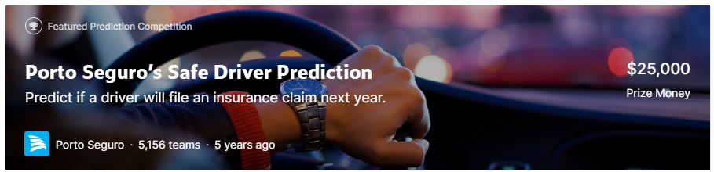

# **Part II. 머신러닝 문제해결**

# **Chapter 8. [경진대회] 안전 운전자 예측 경진대회**
### **Porto Seguro’s Safe Driver Prediction**
### Predict if a driver will file an insurance claim next year.

- [Kaggle Link](https://www.kaggle.com/competitions/porto-seguro-safe-driver-prediction)

# 0. 경진대회 이해 💁🏻‍♂️

- **Goal**: 운전자가 보험금을 청구할 확률을 정확히 예측하는 모델 제작

## 0-1. 주어진 데이터 특정

- 주어진 데이터는 포르투 세구로가 보유한 고객 데이터
- 결측값이 많음
    - 결측값은 `-1`로 기록

- 타깃값은 `0` 또는 `1`
    - `0`: 운전자가 보험금을 청구하지 않음
    - `1`: 청구
    - 타깃값이 두 개이므로 본 대회는 **이진분류 문제**

 

# 1. 분석 정리 및 모델링 전략

## 1-1. 분석 정리

1. 데이터가 크고 피처도 많다.
2. 피처명만으로 분류별 혹은 데이터 종류별 피처들을 구분해 추출할 수 있다.
3. **결측값 처리**: 결측값 자체에 타깃값 예측력이 있다면 고윳값으로 간주
4. **결측값 처리**: 피처 간 상관관계 분석은 결측값 제거 후 수행
5. **피처 제거**: 신뢰구간이 넓으면 믿을 수 없음
    - `ps_ind_14`, `ps_calc_04` ~ `ps_calc_14`
6. **피처 제거**: 고윳값별 타깃값 비율에 차이가 없다면 타깃값 예측력이 없음
    - `ps_calc_04` ~ `ps_calc_14`

7. **피처 제거**: (연속형 데이터의 경우) 구간별 타깃값 차이가 거의 없다면 타깃값 예측력이 없음
    - `ps_calc_01` ~ `ps_calc_03`

8. **피처 제거**: 일반적으로 강한 상관관계를 보이는 두 피처가 있으면 둘 중 하나를 제거하는게 좋음
    - `ps_car_14`

## 1-2. 모델링 전략

- 캐글에서 실제로 많이 활용되는 여러 가지 고급 모델링 기법을 적용할 것
- 주요 키워드: 
    - `OOF 예측`, `베이지안 최적화`, `LightGBM`, `XGBoost`, `앙상블`

- **베이스라인 모델**: LightBGM
    - **훈련 및 예측**: OOF 예측 (과대적합 방지 + 앙상블 효과)
- **성능 개선 1**: LightBGM 유지
    - **피처 엔지니어링**: 파생 피처 추가
    - **하이퍼파라미터 최적화**: 베이지안 최적화

- **성능 개선 2**: XGBoost (모델만 변경)

- **성능 개선 3**: LightBGM + XGBoost 앙상블

